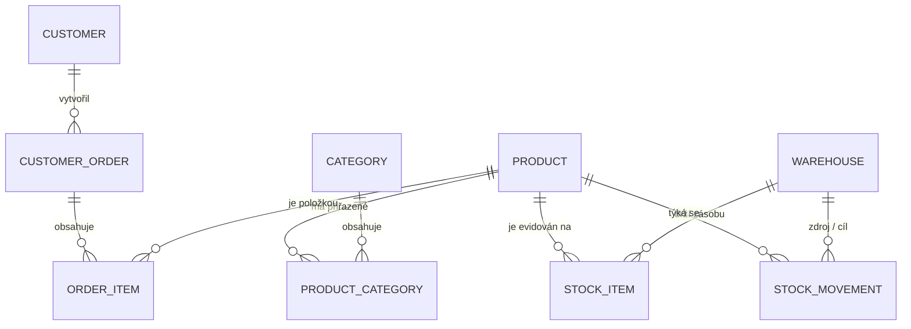

# Hrubý technický a architektonický návrh aplikace

> **Projekt:** Skladový a objednávkový systém Dřevěnka s.r.o.  
> **Předmět:** Pokročilé programování (PPRO, ZS 2026/2027), FIM UHK  
> **Zadání:** Zadání B: Sklad pro malý e-shop (Petr Doležal)  
> **Technologický stack:** Java 21 LTS, Spring Boot 3.4.x, PostgreSQL 16 v Dockeru, Flyway, Thymeleaf + Vanilla CSS  

---

## 1. Cíl a rozsah aplikace

Aplikace nahrazuje dosavadní neudržitelný 400položkový Excel a ruční přepisování objednávek ve firmě Dřevěnka s.r.o.
Jejím primárním cílem je:
1. **Zabránit prodeji neexistujícího zboží (overselling):** Okamžitá rezervace kusů při vzniku objednávky a striktní odmítnutí při nedostatku volných zásob.
2. **Přesná evidence dvou skladů:** Centrální expediční sklad v Hradci Králové a sezónní sklad v garáži v Třebechovicích.
3. **Plná dohledatelnost pohybů (Stock Movement Ledger):** Každá změna zásoby je zaznamenána v neměnné auditní knize.
4. **Řízení meziskladových přesunů (Svozů):** Formalizovaný převod zboží z garáže do Hradce.
5. **Ergonomické rozhraní pro mobil:** Petr Doležal tráví půl dne v montérkách ve skladu, rozhraní je optimalizováno pro dotykové ovládání s barevnou indikací „Co hoří“.

---

## 2. Třívrstvá architektura a struktura balíčků

Aplikace striktně dodržuje třívrstvou architekturu se závislostmi jedním směrem:

```
+-----------------------------------------------------------------------------------+
|               Prezentační vrstva (cz.uhk.fim.ppro.drevenka.controller / api)       |
|  - Web UI (Thymeleaf šablony pro mobil i desktop, optimalizované formuláře)       |
|  - REST API endpointy pro příjem objednávek z e-shopu                             |
+-----------------------------------------------------------------------------------+
                                          │
                                          ▼
+-----------------------------------------------------------------------------------+
|             Aplikační vrstva (cz.uhk.fim.ppro.drevenka.service / domain)          |
|  - Byznys logika: Disponibilní zásoba, rezervace, meziskladové svozy, inventura   |
|  - Stavový automat objednávek, kalkulace kategoriového obratu, validační pravidla |
+-----------------------------------------------------------------------------------+
                                          │
                                          ▼
+-----------------------------------------------------------------------------------+
|            Datová vrstva (cz.uhk.fim.ppro.drevenka.repository / entity)           |
|  - Spring Data JPA rozhraní, relační schéma PostgreSQL 16                         |
|  - Verzované migrace Flyway (V1 DDL, V2 Seed syntetických dat)                    |
+-----------------------------------------------------------------------------------+
```

### Balíčková struktura projektu
```text
cz.uhk.fim.ppro.drevenka/
├── config/                     # Konfigurace Spring, WebMvc, formátování
├── controller/                 # Webové Spring MVC kontrolery pro UI
│   ├── DashboardController.java   # Hlavní dashboard, sekce "Co hoří"
│   ├── ProductController.java     # Katalog hraček, správa kategorií a cen
│   ├── WarehouseController.java   # Sklady, příjem z výroby, převodky, inventura
│   ├── OrderController.java       # Správa a expedice objednávek
│   └── ReportController.java      # Měsíční obrat po kategoriích
├── api/                        # REST API pro externí systémy (e-shop)
│   ├── OrderApiController.java    # POST /api/v1/orders (příjem / odmítnutí)
│   └── StockApiController.java    # GET /api/v1/stock/availability
├── service/                    # Byznys logika a transakční hranice
│   ├── StockService.java          # Výpočet disponibilní zásoby, rezervace, odpisy
│   ├── WarehouseTransferService.java # Meziskladový svoz Třebechovice -> Hradec
│   ├── InventoryService.java      # Skladová inventura a dorovnání manka/přebytku
│   ├── OrderProcessingService.java# Zpracování objednávky, storno, expedice
│   └── ReportingService.java      # Agregace obratu a marže po kategoriích
├── repository/                 # Spring Data JPA repozitáře
│   ├── ProductRepository.java
│   ├── CategoryRepository.java
│   ├── WarehouseRepository.java
│   ├── StockItemRepository.java
│   ├── StockMovementRepository.java
│   ├── CustomerRepository.java
│   └── CustomerOrderRepository.java
├── domain/                     # JPA Entity (Doménový model)
│   ├── Product.java
│   ├── Category.java
│   ├── Warehouse.java
│   ├── StockItem.java
│   ├── StockMovement.java
│   ├── Customer.java
│   ├── CustomerOrder.java
│   └── OrderItem.java
├── dto/                        # Přenosové objekty a formuláře
│   ├── OrderCreateDto.java
│   ├── StockTransferForm.java
│   ├── InventoryForm.java
│   └── CategoryReportDto.java
└── exception/                  # Doménové výjimky a GlobalExceptionHandler
    ├── InsufficientStockException.java
    └── BusinessRuleException.java
```

---

## 3. Relační databázový model (ERD)

Schéma obsahuje 9 tabulek splňujících povinné minimum předmětu PPRO (minimálně 5 entit + vazba M:N):



### Popis tabulek a integritních omezení:

1. **`products` (Katalog dřevěných hraček):**
   - `id` (BIGSERIAL, PK)
   - `code` (VARCHAR(50), UNIQUE, NOT NULL) – např. `KAC-001`
   - `name` (VARCHAR(150), NOT NULL) – např. „Dřevěná káča barevná“
   - `description` (TEXT)
   - `purchase_price` (NUMERIC(10,2), NOT NULL) – nákupní cena / výrobní náklad
   - `selling_price` (NUMERIC(10,2), NOT NULL) – aktuální prodejní cena v e-shopu
   - `min_stock_limit` (INT, NOT NULL, DEFAULT 5) – hranice pro sekci „Co hoří“
   - `is_active` (BOOLEAN, DEFAULT TRUE)
   - `created_at` (TIMESTAMP, NOT NULL)

2. **`categories` (Kategorie hraček):**
   - `id` (BIGSERIAL, PK)
   - `name` (VARCHAR(100), UNIQUE, NOT NULL) – např. „Pro batolata“, „Dárky do 500 Kč“
   - `description` (TEXT)

3. **`product_categories` (Vazební tabulka M:N):**
   - `product_id` (BIGINT, FK -> `products.id`, PK)
   - `category_id` (BIGINT, FK -> `categories.id`, PK)

4. **`warehouses` (Fyzické sklady):**
   - `id` (BIGSERIAL, PK)
   - `code` (VARCHAR(30), UNIQUE, NOT NULL) – `HRADEC`, `TREBECHOVICE`
   - `name` (VARCHAR(100), NOT NULL) – „Hlavní expediční sklad Hradec“, „Sezónní garáž Třebechovice“
   - `is_expedition_point` (BOOLEAN, NOT NULL) – TRUE pouze pro Hradec Králové

5. **`stock_items` (Stav zásob produktu na konkrétním skladu):**
   - `id` (BIGSERIAL, PK)
   - `product_id` (BIGINT, FK -> `products.id`, NOT NULL)
   - `warehouse_id` (BIGINT, FK -> `warehouses.id`, NOT NULL)
   - `physical_quantity` (INT, NOT NULL, DEFAULT 0, CHECK (`physical_quantity` >= 0))
   - `reserved_quantity` (INT, NOT NULL, DEFAULT 0, CHECK (`reserved_quantity` >= 0))
   - *Unikátní kompozitní index:* `UNIQUE(product_id, warehouse_id)`

6. **`stock_movements` (Neměnný auditní skladový deník):**
   - `id` (BIGSERIAL, PK)
   - `product_id` (BIGINT, FK -> `products.id`, NOT NULL)
   - `source_warehouse_id` (BIGINT, FK -> `warehouses.id`, NULLABLE)
   - `target_warehouse_id` (BIGINT, FK -> `warehouses.id`, NULLABLE)
   - `quantity` (INT, NOT NULL)
   - `movement_type` (VARCHAR(30), NOT NULL) – `RECEIPT`, `DISPATCH`, `TRANSFER`, `INVENTORY_CORRECTION`
   - `order_id` (BIGINT, NULLABLE)
   - `performed_by` (VARCHAR(100), NOT NULL) – jméno pracovníka (např. „Petr Doležal“)
   - `reason_note` (TEXT)
   - `created_at` (TIMESTAMP, NOT NULL, DEFAULT CURRENT_TIMESTAMP)

7. **`customers` (Zákazníci e-shopu):**
   - `id` (BIGSERIAL, PK)
   - `name` (VARCHAR(150), NOT NULL)
   - `email` (VARCHAR(150), NOT NULL)
   - `phone` (VARCHAR(50))
   - `shipping_address` (TEXT)
   - `is_active` (BOOLEAN, DEFAULT TRUE) – zákaz mazání (soft-delete)

8. **`customer_orders` (Objednávky):**
   - `id` (BIGSERIAL, PK)
   - `order_number` (VARCHAR(50), UNIQUE, NOT NULL) – např. `OBJ-2026-0042`
   - `customer_id` (BIGINT, FK -> `customers.id`, NOT NULL)
   - `order_date` (TIMESTAMP, NOT NULL)
   - `status` (VARCHAR(30), NOT NULL) – `PENDING`, `WAITING_FOR_TRANSFER`, `CONFIRMED`, `SHIPPED`, `CANCELLED`, `REJECTED`
   - `total_price` (NUMERIC(10,2), NOT NULL)
   - `note` (TEXT)

9. **`order_items` (Položky objednávky – Price Snapshot):**
   - `id` (BIGSERIAL, PK)
   - `order_id` (BIGINT, FK -> `customer_orders.id`, NOT NULL)
   - `product_id` (BIGINT, FK -> `products.id`, NOT NULL)
   - `quantity` (INT, NOT NULL, CHECK (`quantity` > 0))
   - `unit_price` (NUMERIC(10,2), NOT NULL) – zafixovaná cena v době nákupu

---

## 4. Klíčové byznys algoritmy

### 4.1 Výpočet disponibilní zásoby a okamžitá rezervace (Prevence oversellingu)
1. **Definice zásoby:**
   $$\text{Disponibilní zásoba} = \text{Fyzická zásoba na regále} - \text{Rezervovaná zásoba}$$
2. **Přijetí objednávky:**
   - Zkontroluje se disponibilní zásoba na hlavním skladě Hradec Králové.
   - Pokud je dostatek: zvýší se `reserved_quantity` a stav objednávky je `CONFIRMED`.
   - Pokud je v Hradci nedostatek, ale v garáži v Třebechovicích je zbytek:
     - Zarezervuje se dostupná část v Hradci a chybějící část v Třebechovicích.
     - Objednávka získá stav `WAITING_FOR_TRANSFER` a systém vygeneruje svozový list.
   - Pokud ani součet volných zásob na obou skladech nestačí:
     - Objednávka je **ihned odmítnuta** (`REJECTED`).
     - Žádné peníze se nestrhnou, žádný zákazník nemusí být telefonicky omlouván.

### 4.2 Meziskladový svoz (Třebechovice -> Hradec Králové)
Operace probíhá v atomické databázové transakci:
1. Odpis z garáže: `physical_trebechovice -= qty`, `reserved_trebechovice -= qty`.
2. Příjem v Hradci: `physical_hradec += qty`, `reserved_hradec += qty`.
3. Vytvoření záznamu `StockMovement` (typ `TRANSFER`, source: Třebechovice, target: Hradec).
4. Pokud byly objednávky ve stavu `WAITING_FOR_TRANSFER`, automaticky přecházejí do `CONFIRMED` k zabalení.

### 4.3 Fyzická expedice balíku (Balicí stůl)
1. Skladník v Hradci zabalí zboží a stiskne tlačítko **„Expedovat zásilku“**.
2. Pro každou položku:
   - `physical_hradec -= quantity`
   - `reserved_hradec -= quantity`
   - Záznam do `StockMovement` (typ `DISPATCH`).
3. Stav objednávky přechází na `SHIPPED`.

### 4.4 Skladová inventura (Řešení nesrovnalostí v garáži)
1. Klient přepočítá regál a zadá skutečný počet kusů $N$.
2. Rozdíl $\Delta = N - \text{physical\_quantity}$.
3. Nastaví se $\text{physical\_quantity} = N$.
4. Zápis do `StockMovement` (typ `INVENTORY_CORRECTION`, množství: $\Delta$, poznámka: důvod manka/přebytku).
5. Záporný stav je vyloučen, audit je transparentní.

---

## 5. Uživatelské rozhraní a navigační strom

Aplikace je navržena jako responzivní web v Thymeleafu s optimalizací pro mobilní zařízení (skladník v montérkách):

### 5.1 Navigace
- `/` – **Úvodní Dashboard:**
  - Sekce **„🔴 CO HOŘÍ“** – zboží s disponibilní zásobou pod limitem `min_stock_limit`.
  - Počítadla: Objednávky k zabalení, položky ke svozu z Třebechovic.
  - Tlačítka rychlých akcí: *Příjem z výroby*, *Svoz z garáže*, *Hledat hračku*.
- `/products` – **Katalog hraček:**
  - Vyhledávání podle názvu a kódu (SKU).
  - Filtrování podle kategorií.
  - Zobrazení skladových zásob rozpadlých na Hradec a Třebechovice.
- `/warehouses` – **Správa skladů a pohybů:**
  - Výběr skladu (Hradec / Třebechovice).
  - Formulář převodu mezi sklady (svoz dodávkou).
  - Formulář inventury s povinným zadáním důvodu.
  - Auditní deník skladových pohybů.
- `/orders` – **Přehled objednávek:**
  - Filtrování dle stavu (`K expedici`, `Čeká na svoz`, `Odesláno`, `Odmítnuto`).
  - Detail objednávky s tlačítkem *Zabalit a expedovat*.
- `/reports` – **Měsíční report obratu:**
  - Výběr kalendářního měsíce a roku.
  - Tržby, nákupní náklady, marže a podíl jednotlivých kategorií hraček.

---

## 6. Plán realizace dema (Fáze 2)

Pro předvedení klientovi (Petr Doležal / vyučující) implementujeme první funkční demo zaměřené na:
1. **Založení Spring Boot 3 projektu** s Docker Compose (PostgreSQL 16) a Flyway migrací.
2. **Katalog produktů a kategorií (M:N vazba).**
3. **Zobrazení zásob na dvou skladech (Hradec vs. Třebechovice).**
4. **Dashboard „Co hoří“** s barevným zvýrazněním položek pod minimálním limitem.
5. **Jednoduchá skladová operace:** Příjem z truhlárny a meziskladový převod z garáže do Hradce se zápisem do pohybového deníku.
